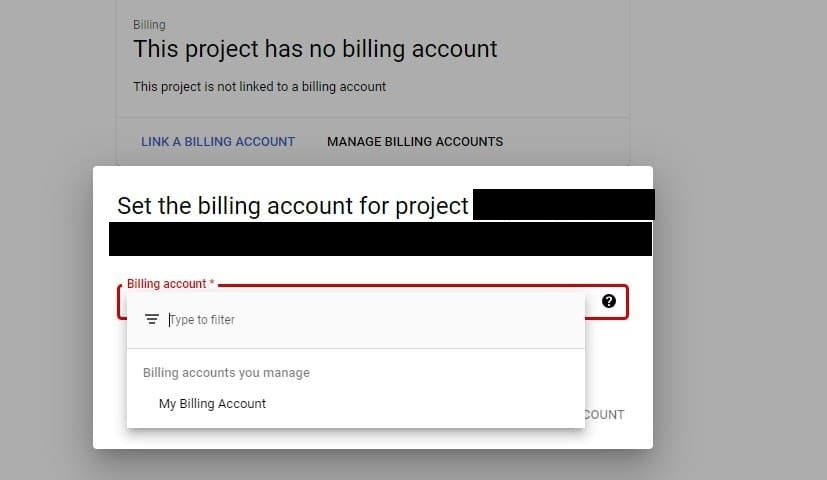
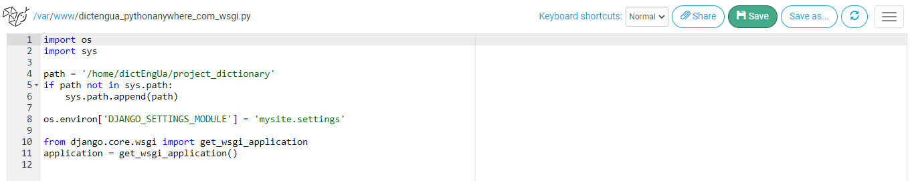

# Dictionary Web Application

Дипломна робота складається з двох програмних модулів:
- [Модуль наповнення бази даних](https://github.com/PiatachenkoMila/DataBase)
- Веб-додаток (цей репозиторій)
## Технічне забезпечення
Програмна частина дипломної роботи виконувалась мовою програмування Python;
версія інтерпретатора: 3.7.2

Мінімальне технічне забезпечення:
- Python>=3.6.0<3.9.0
- DbBrowserForSqlite
- Текстовий редактор
- Веб-браузер

## Встановлення на локальному комп'ютері
Перед початком роботи потрібно створити віртуальне середовище розроблення.

Відкрийте командний рядок та введіть команду:

```
python -m venv project_dictionary_venv
```
Активуйте віртуальне середовище за допомогою команди:
```
project_dictionary_venv\Scripts\activate
```

Встановіть необхідні python-бібліотеки за допомогою команди:
```
pip install -r requirements.txt
```

У разі виникнення проблем зі встановленням бібліотеки <b>python-Levenshtein</b>, потрібно перейти за покликанням:
[https://www.lfd.uci.edu/~gohlke/pythonlibs/#python-levenshtein](https://www.lfd.uci.edu/~gohlke/pythonlibs/#python-levenshtein)
та завантажити whl-файл відповідно до Вашої версії Python.
Встановіть python-бібліотеку python-Levenshtein із скачаного whl-файлу за допомогою команди:
```
pip install шлях_до_скачаного_whl_файлу
```
Повторіть команду (щоб переконатись, що всі необхідні бібліотеки встановлено):
```
pip install -r requirements.txt
```
Для автоматичного реферування потрібно додатково встановити nltk-пакет punkt, запустивши даний скрипт:
```
python dict/python_prog/install_punkt.py
```
Скрипт <b>install_punkt.py</b> має вигляд:
```
import nltk
nltk.download('punkt', download_dir='project_dictionary_venv/nltk_data')
```

Якщо тека створеного Вами віртуального середовища 
має іншу назву (не <b>project_dictionary_venv</b>), зробіть, будь ласка,
необхідні зміни у файлі <b>install_punkt.py</b>


Результати реферування зберігаються у спеціальній базі даних <code>db.sqlite3</code>, що керується фреймворком <code>Django</code>.
Для створення цієї бази даних потрібно виконати команду:
```
python manage.py migrate
```
Для створення в базі даних таблиці, в якій зберігатимуться результати реферування, потрібно виконати такі команди:
```
python manage.py makemigrations dict
python manage.py migrate dict
```

## Налаштування озвучення
Для озвучення термінів, тлумачень та контекстів використано платформу хмарних технологій Google Cloud.
Озвучення здійснено за допомогою Google Cloud Text-to-speech API.
Для цього Вам знадобиться:
+ Аккаунт Google
+ банківська карта (потрібна для аутентичності особи власника аккаунту)

### Створення нового проекту на платформі GoogleCloud.

Перейдіть за покликанням: https://console.cloud.google.com/

У верхній частині екрану натисність на кнопку <b>Activate</b>


Для створення нового проекту натисність кнопку <b>Create project</b>


Перейдіть до меню <b>Billing (оплата)</b>. Натисніть <b>Link a billing account</b>


Виберіть <b>My billing account</b>



### Підключення Text-to-speech API до створеного проекту

Перейдіть за покликанням: https://cloud.google.com/text-to-speech/docs/quickstart-client-libraries#client-libraries-usage-python


Та оберіть крок (4): <b>Enable the API</b>

Виберіть новостворений проект 


### Створення сервісного аккаунта

За [вищенаведеним покликанням](https://cloud.google.com/text-to-speech/docs/quickstart-client-libraries#client-libraries-usage-python) оберіть крок (5.a) <b>Go to Create service account</b>

Оберіть новостворений проект


До форми створення сервісного аккаунту

Введіть такі дані:
+ MyServiceAccount
+ service
+ ServiceDescription


Крок (2): натисність Continue


  
Крок (3): натисність Done


### Створення ключа сервісного аккаунта
   

   
У стовпчику <b>Actions</b> натисніть на три крапки та виберіть <b>Manage keys</b>
     


Виберіть <b>Add key</b>, потім виберіть <b>Create a new key</b>
     


Виберіть <b>JSON</b>
     


### Подальші дії з ключем сервісного аккаунта
У результаті на комп'ютер буде завантажено JSON-файл з ключем. Даний файл потрібно помістити до теки з кодом проекту.

Для підключення озвучення до проекту потрібно внести такі зміни у файлі mysite/settings.py (рядки 124-125)
```
ENABLE_TTS_AUDIO = True
CREDENTIALS_FILENAME = "імя_json_файлу.json"
```
## База даних
Файл бази даних можна завантажити [за покликанням](https://drive.google.com/drive/folders/1LbtnmXV0c-Veh1Sn8KZWRokF-EaI-WZd).
Файл бази даних потрібно помістити до кореневої теки цього проекту.

## Розгортання веб-додатка на локальному комп'ютері
Потрібно виконати таку команду:
```
python manage.py runserver
```
Після запуску у командному рядку з'явиться веб-адреса, яку потрібно скопіювати до рядка адрес у браузері

## Етапи розгортання веб-додатка на хостингу [pythonanywhere.com](https://www.pythonanywhere.com/)
Версія інтерпретатора Python, що була використана для розгортання на хостингу, - Python 3.7.0

1. Реєстрація аккаунту на хостингу за цим покликанням [pythonanywhere.com/pricing/](https://www.pythonanywhere.com/pricing/)
    Я зареєструвала безкоштовний аккаунт Beginner
   


Поле <b>Username</b> - доменне ім'я Вашого сайту.

Наприклад, якщо вказати Username <b>abcsite</b>, то Ваш сайт буде розміщено за адресою:
http://abcsite.pythonanywhere.com/


Зауважте, що за умовами аккаунту Beginner після реєстрації не можна змінити доменне ім'я сайту.

2. Завантажити на хостинг архів з кодом даного проекту. Потрібно перейти на вкладку <b>Files</b>:
   


Код проекту я заархівувала до архіву, завантажила за допомогою кнопки <b>Upload a file</b>:


3. Перейти на вкладку <b>Consoles</b>, відкрити Bash-консоль.

   

4. Розархівувати архів з кодом проекту. Наприклад, файл архіву має назву <b>project_dictionary_v1.09.zip</b>, тека з кодом проекту матиме назву <b>project_dictionary</b>

До Bash-консолі потрібно ввести таку команду:
```
unzip project_dictionary_v1.09.zip -d project_dictionary
```


5. Створити віртуальне середовище розроблення, ввівши до Bash-консолі наступну команду:
```
mkvirtualenv project_dictionary_venv --python=/usr/bin/python3.7
```


6. Перейти до теки з кодом проекту, встановити необхідні бібліотеки за допомогою команди:
```
pip install -r requirements.txt
```


7. Виконати команди зі встановлення nltk-пакету <b>punkt</b>, необхідного для токенізації речень у процесі автоматичного реферування:


8. Якщо файл з базою даних <code>db.sqlite3</code> не створено, виконати команди для його створення:
```
python manage.py migrate
python manage.py makemigrations dict
python manage.py migrate dict
```


9. Виконати команду збору статичних файлів проекту:
```
python manage.py collectstatic
```
10. Помістити файл з базою даних <code>dictionary.db</code> до теки з кодом проекту.
Заархівуйте файл бази даних <code>dictionary.db</code> до zip-архіву, до прикладу, <code>dictionary.zip</code>
   Завантажте архів на хостинг. Розархівуйте до теки з кодом (наприклад, тека має назву <b>project_dictionary</b>), виконавши в Bash-консолі таку команду:
   ```
   unzip dictionary.zip -d project_dictionary
   ```
11. Помістити до теки з кодом проекту JSON-файл ключа аккаунта Google Cloud.  
12. Перейти на вкладку <b>Web</b> для розгортання веб-додатка.
   Натисніть на <b>Add new web app</b>. 

   a) <b>Select a Python Web Framework</b>: вкажіть "<b>>>Manual configuration</b>"
   
   b) <b>Select a Python version</b>: виберіть <b>Python 3.7</b>. Ви також можете вибрати версію 3.6 або 3.8
   
   c) У секції <b>Code</b> для "Source code" та "Working directory" потрібно вказати шлях до теки з кодом проекту
   


   d) У секції <b>virtualenv</b> потрібно вказати шлях до теки з віртуальним середовищем:
   ```
   /home/імя_користувача/.virtualenvs/project_dictionary_venv
   ```


   e) У секції <b>Static files</b> вказати шлях до теки статичних файлів:
   <table>
   <tr>
   <td>URL</td>
   <td>Directory</td>
   </tr>
   <tr>
   <td>/static/</td>
   <td>/шлях_теки_з_кодом/dict/static</td>
   </tr>
   </table>


   f) У секції <b>Code</b> потрібно клікнути на покликання шляху файлу <b>WSGI configuration file</b>
   Відкриється текстовий редактор з вмістом файлу. Потрібно замінити вміст файлу на наступний:
   ```
   import os
   import sys

   path = 'шлях_до_теки_з_кодом'
   if path not in sys.path:
      sys.path.append(path)

   os.environ['DJANGO_SETTINGS_MODULE'] = 'mysite.settings'

   from django.core.wsgi import get_wsgi_application
   application = get_wsgi_application()
   ```



   g) Потрібно внести зміни до файлу <b>шлях_до_теки_з_кодом/mysite/settings.py</b>
   Змінити рядок 28, додати до списку ALLOWED_HOSTS адресу Вашого сайту на pythonanywhere.com
   ```
   ALLOWED_HOSTS = ["адреса_Вашого_сайту"]
   ```
h) Натисність кнопку <b>Reload</b>


